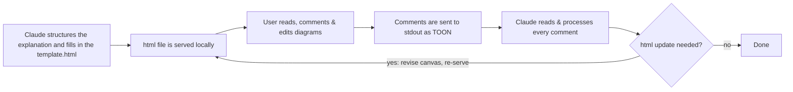

# Talkboard

Inspired by the [lavish editor](https://github.com/kunchenguid/lavish-axi) - A skill that visualizes a complex concept as an interactive, annotatable HTML document instead of a long chat response. Users can review the explanation in their browser and comment directly on the specific sections for Claude to revise. Mermaid diagrams help visualize the concept, if helpful also user editable cytoscape graph sections are added. 

## Why

Long chat explanations are both - hard to grasp and also hard to give feedback on: there's no way to point at "this specific part" without quoting it back. This skill gives the explanation a structure - sections and optional diagrams for visualization — that the user can click directly and turns their feedback into a compact, structured format Claude then processes and updates the html accordingly.

## How it works



Claude launches the collector script as a backgrounded process and is notified automatically when it exits (submitted, timed out, or manually stopped), rather than polling for completion.

## Installation

Copy this directory into your Claude Code skills folder:

```bash
cp -r concept-canvas ~/.claude/skills/concept-canvas
```

## Usage

The skill triggers automatically in Claude Code when a reply would otherwise be a long structured explanation - such as architectures, algorithms, data flows or migration plans. It also triggers on explicit requests such as "explain X as an interactive canvas" or "give me an annotatable doc for X".

## Output format (TOON)

Annotations are returned as [TOON](https://github.com/toon-format/toon) (Token-Oriented Object Notation) rather than JSON - this is a flat, indentation-based format that is more token-efficient for an LLM to read back:

## Server lifecycle

`serve_and_collect.py` is a one-shot local HTTP server, not a long-running service:

| Exit code | Meaning |
|---|---|
| `0` | Annotations were submitted, or the session was ended deliberately via the in-page "Server beenden" button with nothing sent |
| `2` | Timeout — the user did not respond within `--timeout` seconds (default 1800) |
| `3` | Malformed submission payload |


## Project structure

```
concept-canvas/
├── SKILL.md                        Trigger conditions and the step-by-step workflow Claude follows
├── scripts/serve_and_collect.py     Local HTTP server, JSON→TOON conversion, exit codes
├── assets/template.html             Canvas template: annotation UI, Mermaid rendering, submit/fallback logic
└── references/toon-format.md        TOON grammar reference
```

## Requirements

- Claude Code
- Python 3 (standard library only, **no dependencies to be installed**)
- A browser that can reach `localhost`
